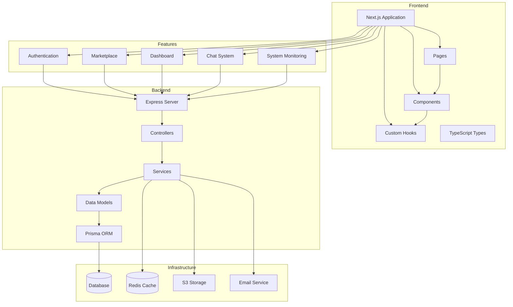

    

    <b>Automatic Architecture Diagrams from Code</b> 
    <a href="https://github.com/swark-io/swark">GitHub</a> • <a href="https://swark.io">Website</a> • <a href="mailto:contact@swark.io">Contact Us</a>

## Usage Instructions

1. **Render the Diagram**: Use the links below to open it in Mermaid Live Editor, or install the [Mermaid Support](https://marketplace.visualstudio.com/items?itemName=bierner.markdown-mermaid) extension.
2. **Recommended Model**: If available for you, use `claude-3.5-sonnet` [language model](vscode://settings/swark.languageModel). It can process more files and generates better diagrams.
3. **Iterate for Best Results**: Language models are non-deterministic. Generate the diagram multiple times and choose the best result.

## Generated Content
**Model**: Claude 3.5 Sonnet (Preview) - [Change Model](vscode://settings/swark.languageModel)  
**Mermaid Live Editor**: [View](https://mermaid.live/view#pako:eNp9VE1vozAQ_SvIp1Zq95JbDis1pdXuSulWpTfTwwQmwRuwkW2qRlX_-_oDjImjchjG73nG45kHn6QSNZI1KflBQt9kr5uSZ-ZRw84Dj1Jwjbz2sH2e8EP_Kah9_finsru-b1kFmgn-Nm96hgMq6myE3ouuFxy5VnR2I_6XEEdDDUqLzi8i8vXUm5TWFpVkvfbAuMFVeFb6BqrjovIC5TtK-vDRS1RqXC7K41qKtkVp6wv-2zIDq0wZkxNxW9PJVtEcNIx-3A_JVAfUv7K_L9tv6v7N9xKUlkOlB4lzjnxDr2z2HSi8jnK_YM0UvXKv7B6qZsEWK1qsskILaYYR4Q8dsJY6O13rm5oeEWwxao6_G3RDrTEzTOe_BXlE3bdQIY38aEcOqtkJkDUNXjyKBjS1JitOSmO36DNn5jaMH6jnIiS9gVdrdnv702syQWchJpRToEdd7MX98_o8xluvsjE0aGqKDYDbMKlqjrQrR3lFecL7_k5OUGONXlwWzjfnJYRETiYX8GJ1AXTyuNBKO_cEjOaccGHGaf_NkNNUYaLT4fbE0COUYyPmExMunJgwTlZJqnDigiI3pENpulCbn-RnSYzcOyzJOitJjXsYWl2SL7Np6GvQmDMwn0tH1ubjxRsCgxbFiVfTWorh0JD1HlqFX_8BApK64g) | [Edit](https://mermaid.live/edit#pako:eNp9VE1vozAQ_SvIp1Zq95JbDis1pdXuSulWpTfTwwQmwRuwkW2qRlX_-_oDjImjchjG73nG45kHn6QSNZI1KflBQt9kr5uSZ-ZRw84Dj1Jwjbz2sH2e8EP_Kah9_finsru-b1kFmgn-Nm96hgMq6myE3ouuFxy5VnR2I_6XEEdDDUqLzi8i8vXUm5TWFpVkvfbAuMFVeFb6BqrjovIC5TtK-vDRS1RqXC7K41qKtkVp6wv-2zIDq0wZkxNxW9PJVtEcNIx-3A_JVAfUv7K_L9tv6v7N9xKUlkOlB4lzjnxDr2z2HSi8jnK_YM0UvXKv7B6qZsEWK1qsskILaYYR4Q8dsJY6O13rm5oeEWwxao6_G3RDrTEzTOe_BXlE3bdQIY38aEcOqtkJkDUNXjyKBjS1JitOSmO36DNn5jaMH6jnIiS9gVdrdnv702syQWchJpRToEdd7MX98_o8xluvsjE0aGqKDYDbMKlqjrQrR3lFecL7_k5OUGONXlwWzjfnJYRETiYX8GJ1AXTyuNBKO_cEjOaccGHGaf_NkNNUYaLT4fbE0COUYyPmExMunJgwTlZJqnDigiI3pENpulCbn-RnSYzcOyzJOitJjXsYWl2SL7Np6GvQmDMwn0tH1ubjxRsCgxbFiVfTWorh0JD1HlqFX_8BApK64g)

