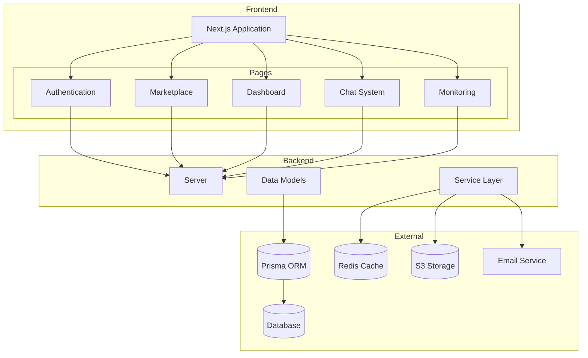

```mermaid
flowchart TD
    subgraph Frontend
        NextJS[Next.js Application]
        subgraph Pages
            Auth[Authentication]
            Marketplace[Marketplace]
            Dashboard[Dashboard]
            Chat[Chat System]
            Monitoring[Monitoring]
        end
    end

    subgraph Backend
        Server[Server]
        Models[Data Models]
        Services[Service Layer]
    end

    subgraph External
        Prisma[(Prisma ORM)]
        DB[(Database)]
        Redis[(Redis Cache)]
        S3[(S3 Storage)]
        Email[Email Service]
    end

    NextJS --> Auth
    NextJS --> Marketplace
    NextJS --> Dashboard
    NextJS --> Chat
    NextJS --> Monitoring

    Auth --> Server
    Marketplace --> Server
    Dashboard --> Server
    Chat --> Server
    Monitoring --> Server

    Models --> Prisma
    Prisma --> DB
    
    Services --> Redis
    Services --> S3
    Services --> Email
```