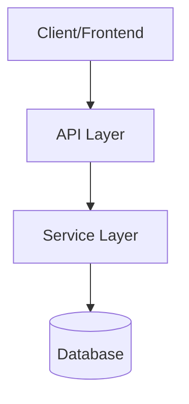
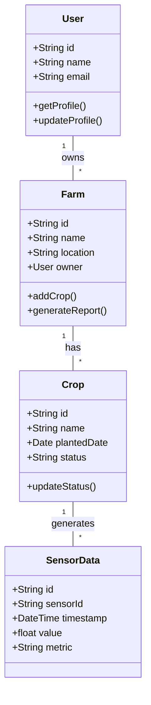
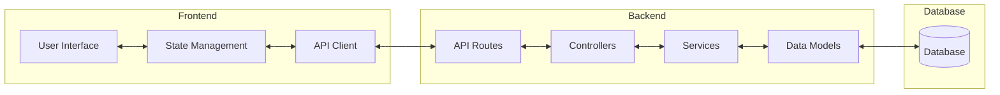
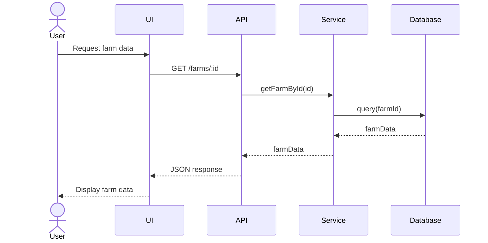
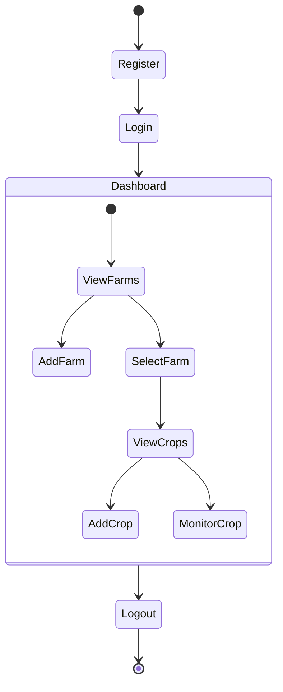
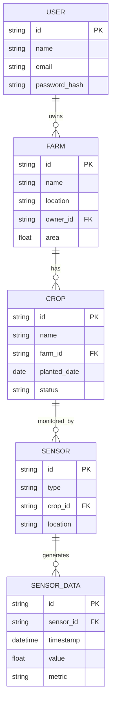

# AgriSmart Codebase Visualization

This document contains various diagrams representing the structure and relationships in the AgriSmart codebase.

## Architecture Overview

## Class Diagram

## Component Diagram

## Sequence Diagram

## Process Flow

## Entity Relationship Diagram

---

To customize these diagrams for your actual codebase:

1. Replace the placeholder classes, components, and entities with your actual code structures
2. Update the relationships to reflect your actual code dependencies
3. Add or remove diagrams as needed based on your project's complexity

You can render these diagrams in any Markdown viewer that supports Mermaid, such as GitHub, or using the Mermaid Live Editor at https://mermaid.live/
